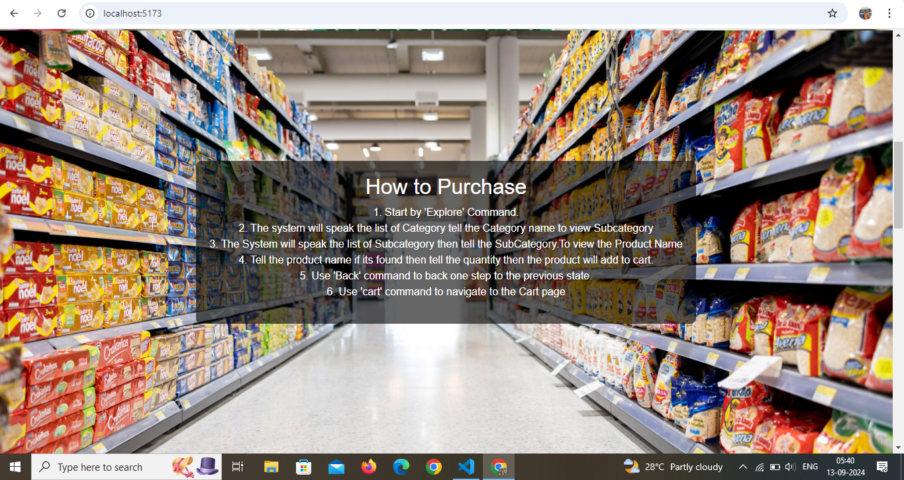

# ** Hey welcome to my project **

                ** VOICE BASED SHOPPING IN SUPERMARKET **


# React + Vite



# **Voice-Based Shopping System**

## **Table of Contents**
1. [Project Overview](#project-overview)
2. [Features](#features)
3. [Technologies Used](#technologies-used)
4. [Installation Instructions](#installation-instructions)
5. [Usage](#usage)
6. [Admin Panel Features](#admin-panel-features)
7. [Contact](#contact)

---

## **Project Overview**
The **Voice-Based Shopping System** is designed to help visually impaired users shop independently in online supermarkets using voice commands. The system provides features like product search, cart management, and order processing through a voice interface. For administrators, it includes inventory management tools, stock notifications via email, and a dashboard to track product availability and transaction history.

## **Features**
- **Voice Commands**: Users can add products to their cart, manage the cart, and generate bills through voice interaction.
- **Voice-Based Registration/Login**: Ensures the entire process is accessible to visually impaired users.
- **Cart Management**: Users can view and modify their cart before checkout.
- **Real-Time Payment Integration**: Allows users to complete purchases directly through the system.
- **Inventory Management**: Admins can manually or bulk update products using Excel uploads.
- **Email Notifications**: Admins receive automatic emails when product stock levels are low.
- **Dashboard**: Displays important statistics such as low-stock items and daily transactions in chart form.

## **Technologies Used**
- **Frontend**: ReactJS
- **Backend**: NodeJS, Express
- **Database**: MongoDB
- **Voice Integration**: Web Speech API (react-speech-regonation)
- **Email Notifications**: NodeMailer
- **Charts**: Chart.js 

## **Installation Instructions**
1. **Clone the Repository**:
   ```bash
   git clone https://github.com/Velmurugan9566/miniproject.git
   ```
2. **Navigate to the Project Directory**:
   ```bash
   cd miniproject
   ```
3. **Install Dependencies**:
   For the frontend:
   ```bash
   cd client
   npm install
   ```
   For the backend:
   ```bash
   cd server
   npm install
   ```
4. **Setup Environment Variables**: Create a `.env` file in the `server` folder and add the necessary environment variables for your database connection, email service, etc.

5. **Start the Application**:
   For the backend:
   ```bash
   npm run server
   ```
   For the frontend:
   ```bash
   npm run client
   ```

6. **Access the Application**: Open your browser and go to `http://localhost:3000`.

## **Usage**
- **User Side**: Users can use voice commands to search for products, add them to the cart, and complete the purchase using the voice-guided checkout process.
- **Admin Side**: Admins can log in to manage products, view sales statistics, and receive notifications about low stock via email.

## **Admin Panel Features**
- **Product Management**: Add, update, or remove products from the inventory.
- **Low Stock Alerts**: Automatically sent email notifications for products with low quantity.
- **Dashboard**: Displays statistical summaries using charts for daily transactions, product stock levels, and more.

## **Contact**
For questions or support, please reach out to:
- **Your Name**: m.velmuruga95@gmail.com
- **Project Repository**: [GitHub Repository](https://github.com/Velmurugan9566)

